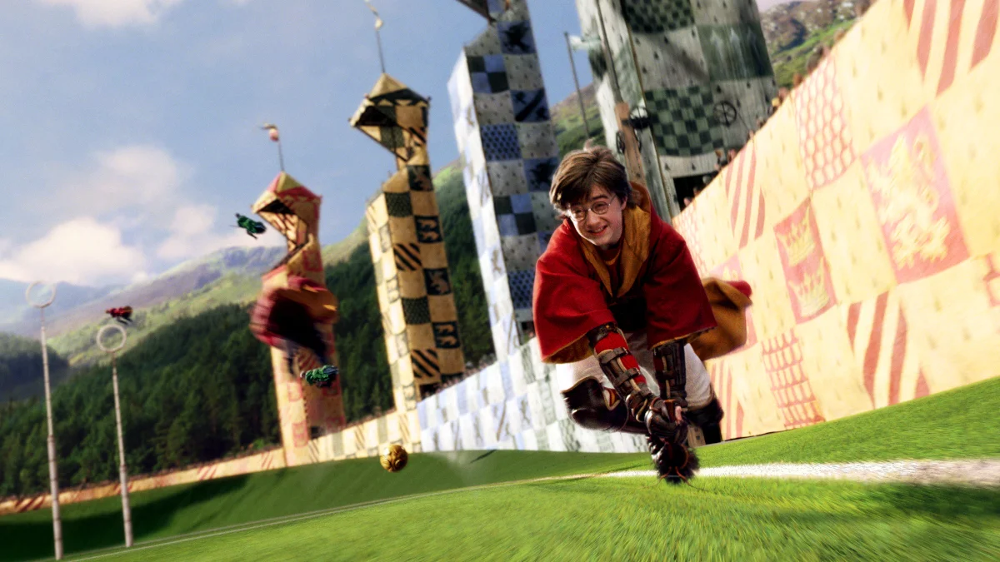

# 🧙‍♂️ PotterVerse Blog 🌟

Welcome to **PotterVerse Blog** — your magical gateway into the world of Hogwarts, wizards, and adventure! This project is a beautifully crafted Harry Potter-themed movie page where fans can explore film details, characters, galleries, and more in a visually immersive experience.

---

## ✨ Project Overview

PotterVerse Blog is a fan-driven entertainment page inspired by *Harry Potter and the Philosopher's Stone*. It combines sleek UI design with thematic animations, interactive ratings, and a collection of posters, videos, and character profiles — all wrapped in a wizarding world aesthetic.

The site aims to:
- Provide movie details like synopsis, cast, ratings, and genre.
- Showcase themed galleries, videos, and interactive elements.
- Create an engaging experience for Potterheads and fantasy lovers alike.

---

## 📂 Features

✔ **Responsive Design** using HTML and CSS  
✔ **Floating candles animation** adding magical flair  
✔ **Movie details panel** with ratings and synopsis  
✔ **Video section** with trailers and clips  
✔ **Interactive Watchlist buttons**  
✔ **Character gallery** featuring Harry, Hermione, Ron, and more  
✔ **Thematic backgrounds** and mystical effects  
✔ **Footer with attribution and branding**

---

## 🎬 Movie Highlighted

**Harry Potter and the Philosopher’s Stone**  
A young wizard embarks on a journey of friendship, mystery, and destiny as he discovers the magical world of Hogwarts and faces the dark forces that threaten it.

---

## 📸 Screenshots

  
  


*And many more enchanting visuals across galleries and sections.*

---

## 🧙‍♀️ Cast Section

Meet the stars behind the magic:
- **Daniel Radcliffe** as Harry Potter  
- **Emma Watson** as Hermione Granger  
- **Rupert Grint** as Ron Weasley  
- ...and many more legendary actors bringing the wizarding world to life.

---

## 🚀 Getting Started

1. Clone the repository:
   
   git clone https://github.com/Aerivsv/Vintage-House-Wear-Project.git


2. Open `index.html` in your favorite browser.

3. Explore Hogwarts, relive the adventure, and dive into the wizarding world!

---

## 🛠 Tech Stack

* HTML5
* CSS3
* JavaScript (for animations and interactions)
* Google Fonts (Roboto)

---

## 📂 Folder Structure

```
/posters     → Images, videos, and assets  
index.html   → Main webpage  
styles.css   → Styling rules  
scripts.js   → JavaScript interactions  
```


## 🤝 Contributing

Feel free to:

* Add new movie sections
* Improve animations and styling
* Fix bugs or enhance responsiveness
* Share your Hogwarts-inspired ideas!

---

## 📜 License

This is a fan-made project for entertainment and learning purposes. All images and content are used under fair use for educational and creative expression.

---

✨ **Let’s relive the magic, one spell at a time!** ✨

